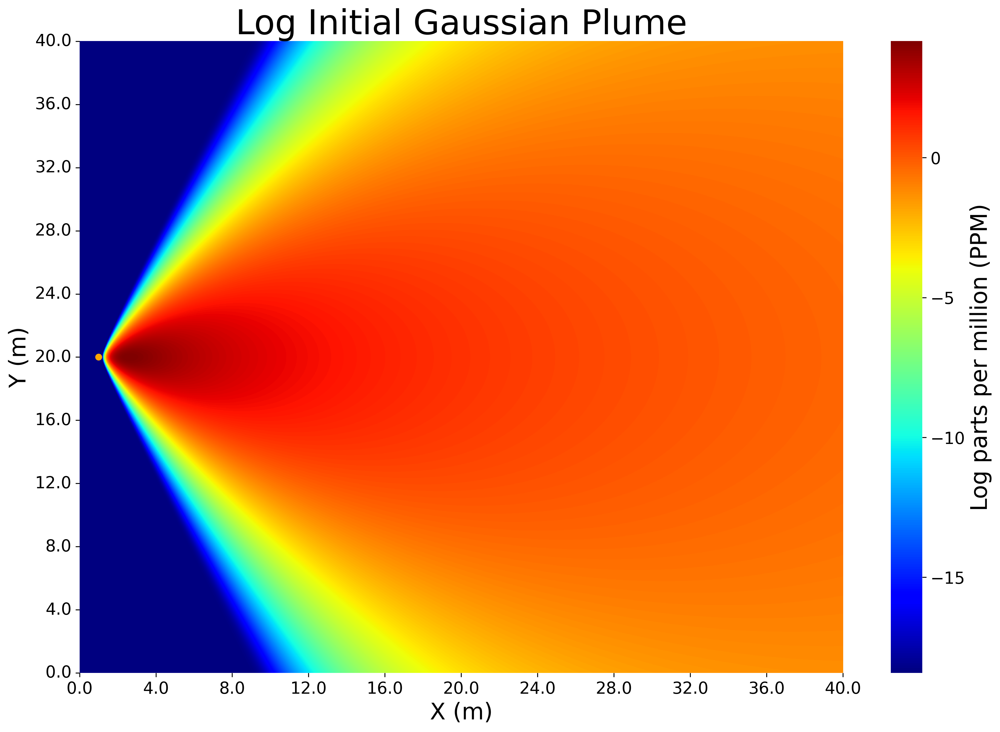
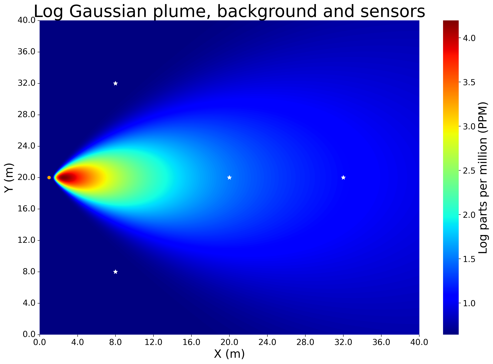

# Bayesian Inversion Modelling for Gas emissions 💨

A lightweight 🐍 library for Gaussian plumes parameter estimation
using gradient based MCMC written in JAX.

## Installation:
```
git clone https://github.com/NewmanTHP.git
cd GasInvert
pip install -e .
```

## Example:
```python
import gasinvert.atmospheric_measurements as gp
import gasinvert.mcmc as mcmc

from jax.flatten_util import ravel_pytree
import matplotlib.pylab as pylab
import matplotlib.pyplot as plt
import jax.numpy as jnp
from jax import config
import seaborn as sns
import numpy as np
import time
import jax
import tensorflow_probability.substrates.jax as tfp
tfd = tfp.distributions


config.update("jax_enable_x64", True)
params = {
        'legend.fontsize': '15',
        'axes.labelsize': '20',
        'axes.titlesize': '30',
        'xtick.labelsize':'x-large',
        'ytick.labelsize':'x-large',
        'figure.figsize': '10, 7',
        }
pylab.rcParams.update(params)


############################################################
# 1. Simulating Atmospheric Conditions and Sensors locations
############################################################

# Make a grid
grid = gp.Grid(
    x_range = (jnp.array(0.0), jnp.array(40.0)), 
    y_range = (jnp.array(0.0), jnp.array(40.0)),
    z_range= (jnp.array(0.0), jnp.array(0.0)), # change it to cube
    dx = jnp.array(4),
    dy = jnp.array(4),
    dz = jnp.array(1),
)

# Choose a source location
source_location = gp.SourceLocation(
    source_location_x = jnp.array(1),
    source_location_y = jnp.array(16),
    source_location_z = jnp.array(1.0),
)

# Define the wind field
wind_field = gp.WindField(
    initial_wind_speed = jnp.array(10.0),
    initial_wind_direction = jnp.array(0.0),
    number_of_time_steps = jnp.array(1_000),
    time_step = jnp.array(1.0),
    wind_speed_temporal_std = jnp.array(1.0),
    wind_direction_temporal_std = jnp.array(30.0),
    wind_temporal_correlation = jnp.array(0.1),
    wind_speed_seed = 2,
    wind_direction_seed = jnp.array(4),
)

# Define an atmospheric state settings
atmospheric_state = gp.AtmosphericState(
    vertical_angle = jnp.deg2rad(jnp.array(25.0)),
    horizontal_angle = jnp.deg2rad(jnp.array(20.0)),
    emission_rate = jnp.array(1.6e-3),      
    half_width = jnp.array(2.0),
    max_abl = jnp.array(1000.0),
    background_mean = jnp.array(1.9),       
    background_std = jnp.array(1e-4),       
    background_seed = jnp.array(56),
    background_filter = "power-law",        
    Gaussian_filter_kernel = 1,              
    downwind_power_H = jnp.array(1.0),         
    downwind_power_V = jnp.array(0.75),         
)

# Define sensor settings
sensors_settings =  gp.SensorsSettings(
    sensor_number = jnp.array(4),
    measurement_error_var = jnp.array(1e-1),
    measurement_elevation = jnp.array(0.0),
    sensor_seed = jnp.array(5),
    measurement_error_seed = jnp.array(420),
    sensor_locations =  [[8, 8], [20,20], [8,32], [32,20]],
)


save = False


## Gaussian plume Class : ---------------------------------------------
gaussianplume = gp.GaussianPlume(grid, source_location, wind_field, atmospheric_state, sensors_settings)
gaussianplume.initial_gaussian_plume_plot(save, format='png')
gaussianplume.log_initial_gaussian_plume_plot(save, format='png')


# Background concentration Class : ---------------------------------------------
background = gp.BackgroundGas(grid, source_location, atmospheric_state)
background.background_plot(save, format='png')


# Sensors Class : ---------------------------------------------
sensors = gp.Sensors(gaussianplume, background)
sensors.atmospheric_methane_and_sensors(save, format='png')
sensors.log_atmospheric_methane_and_sensors(save, format='png')
```




